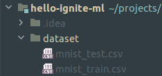

# Hello-Ignite-ML

Пример использования apache-ignite-ml для задачи мультиклассовой классификации.
Датасет MNIST рукописных цифр.

Описание и подробности в [посте](https://not-accidental-chaos.blogspot.com/2023/01/apache-ignite-ml.html#more).

## Сборка и запуск
1. Поместить [датасет](https://www.kaggle.com/datasets/oddrationale/mnist-in-csv) в папку ./dataset в корне проекта.

2. Собрать
`mvn clean package`

3. Запустить
`java -jar ./target/HelloIgniteML.jar`

При запуске из IDE, указать параметры vm (из оф доки):
--add-exports=java.base/jdk.internal.misc=ALL-UNNAMED --add-exports=java.base/sun.nio.ch=ALL-UNNAMED --add-exports=java.management/com.sun.jmx.mbeanserver=ALL-UNNAMED --add-exports=jdk.internal.jvmstat/sun.jvmstat.monitor=ALL-UNNAMED --add-exports=java.base/sun.reflect.generics.reflectiveObjects=ALL-UNNAMED --add-opens=jdk.management/com.sun.management.internal=ALL-UNNAMED --illegal-access=permit

